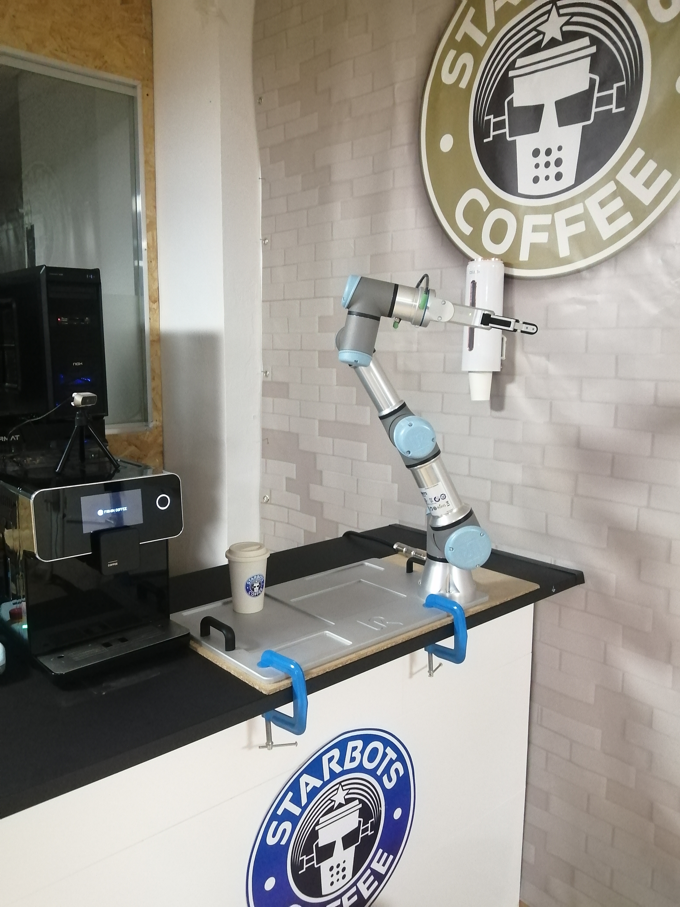

# Starbots Coffee Dispenser Project

## Overview

Starbots Coffee Dispenser is a robotics project that performs a complete Pick and Place task using the **UR3e robotic arm**, designed to operate in both Gazebo simulation and on a real-world setup. The system enables the robot to autonomously locate a coffee cup, pick it up, and place it on a coffee tray mounted on a Barista robot, simulating a real-world coffee-serving interaction.

The project integrates **MoveIt2** for motion planning and execution, and employs perception pipeline with object detection and point cloud processing to locate and interact with objects in the environment. It supports seamless operation in both Gazebo simulation and a real-world setup, utilizing the UR3e arm equipped with a point cloud cameras.

This system is built on ROS 2 and offers modular launch files to execute the full task pipeline — from perception and planning to actuation — in both simulated and physical environments.

---

<p align="center">
  
</p>

## Prerequisites

- ROS 2 Humble
- Starbots Coffee/UR3e Gazebo package for simulation
- Physical UR3e robot and a Point Cloud camera for real-world testing
- `MoveIt2`, `colcon`, and `rosdep` installed


## Getting Started

1. Clone this repository into your ROS 2 workspace (`ros2_ws`),    creating it if it doesn't exist:

    ```bash
    mkdir -p ~/ros2_ws/src
    cd ~/ros2_ws/src
    git clone <this-repo-url>
    cd ~/ros2_ws
    ```

2. Install dependencies:
    ```bash
    # Optional: Use if rosdep not initialized
    sudo rosdep init
    rosdep update
    ```
    ```bash
    cd ~/ros2_ws
    rosdep install --from-paths src --ignore-src -r -y
    ```
3. Build the workspace:
    ```bash
    colcon build && source install/setup.bash
    ```

4. Start the Starbots Coffee Simulation
    ```bash
    ros2 launch the_construct_office_gazebo starbots_ur3e.launch.xml
    ```

## Running the Pick & Place Task

### Test the Setup

Before running the main Pick and Place task, ensure your environment is correctly configured. Whether you're using **Gazebo simulation** or a **real UR3e robot**, follow these checks after launching the robot's control node (Gazebo or hardware interface).

- Check Active Controllers

    Make sure all required controllers are running:

    ```bash
    ros2 control list_controllers
    ```
    **Expected output:**
    ```
    joint_trajectory_controller[joint_trajectory_controller/JointTrajectoryController] active
    joint_state_broadcaster[joint_state_broadcaster/JointStateBroadcaster] active
    gripper_controller[position_controllers/GripperActionController] active
    ```

- Verify that joint state messages are being published:
    ```bash
    ros2 topic echo /joint_states
    ```
    You should see a stream of messages showing joint positions, velocities, etc.

- Ensure both camera are publishing the expected topics:
    ```bash
    ros2 topic list | grep depth_sensor
    ```
    This should return a list of camera-related topics (e.g., /camera_depth_sensor/depth/image_raw, /wrist_rgbd_depth_sensor/depth/image_raw, etc.).

### Simulation

Launch the individual nodes:

MoveIt2 planning node:
```bash
ros2 launch ur3e_sim_moveit_config move_group.launch.py
```

(Optional) RViz for visualization, also can give commands via Moveit2 plugin:
```bash
ros2 launch ur3e_sim_moveit_config moveit_rviz.launch.py
```

Object detection node, extracts table surface and cup from coffee table camera point cloud data:
```bash
ros2 launch object_detection object_detection.launch.py
```
---
**The full pick and place pipeline:**
```bash
ros2 launch ur3e_manipulation pick_and_place_perception.launch.py
```

### Real Robot