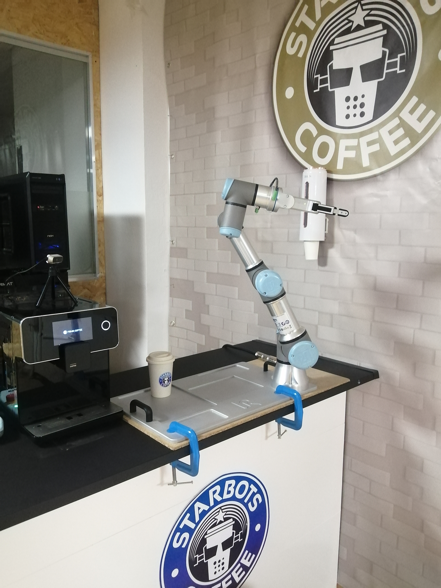

# Starbots Coffee Dispenser Project

## Overview

Starbots Coffee Dispenser is a robotics project that performs a complete Pick and Place task using the **UR3e robotic arm**, designed to operate in both Gazebo simulation and on a real-world setup. The system enables the robot to autonomously locate a coffee cup, pick it up, and place it on a coffee tray mounted on a Barista robot, simulating a real-world coffee-serving interaction.

The project integrates **MoveIt2** for motion planning and execution, and employs perception pipeline with object detection and point cloud processing to locate and interact with objects in the environment. Camera RGB & Depth Images and Pointcloud datas are used for detecting cup holes on the delivery robot tray. The Pointcloud data is also used to construct an **OctoMap**, enabling MoveIt2 to consider the surrounding environment as part of its collision-aware planning. The current branch supports seamless operation in real robot setup.

This system is built on ROS 2 and offers modular launch files to execute the full task pipeline — from perception and planning to actuation in physical environments.

---

<p align="center">
  
</p>

## Prerequisites

#### For host setup

- ROS 2 Humble
- Physical UR3e robot and a Point Cloud camera
- `MoveIt2`, `colcon`, and `rosdep` installed

#### For docker setup

- Docker Engine and Compose

## Getting Started (Host)

1. Clone this repository into your ROS 2 workspace (`ros2_ws`),    creating it if it doesn't exist:

    ```bash
    mkdir -p ~/ros2_ws/src
    cd ~/ros2_ws/src
    git clone <this-repo-url>
    cd ~/ros2_ws
    ```

2. Install dependencies:

    ```bash
    # Optional: Use if rosdep not initialized
    sudo rosdep init
    rosdep update
    ```

    ```bash
    cd ~/ros2_ws
    rosdep install --from-paths src --ignore-src -r -y
    ```

3. Build the workspace:

    ```bash
    colcon build && source install/setup.bash
    ```

## Running the Pick & Place Task

<details>
<summary><b>Test the Setup</b></summary>

Before running the main Pick and Place task, ensure your environment is correctly configured. Whether you're using **Gazebo simulation** or a **real UR3e robot**, follow these checks after launching the robot's control node (Gazebo or hardware interface).

- Check Active Controllers

    Make sure all required controllers are running:

    ```bash
    ros2 control list_controllers
    ```

    **Expected output:**

    ```
    joint_trajectory_controller[joint_trajectory_controller/JointTrajectoryController] active
    joint_state_broadcaster[joint_state_broadcaster/JointStateBroadcaster] active
    gripper_controller[position_controllers/GripperActionController] active
    ```

- Verify that joint state messages are being published:

    ```bash
    ros2 topic echo /joint_states
    ```

    You should see a stream of messages showing joint positions, velocities, etc.

- Ensure both camera are publishing the expected topics:

    ```bash
    ros2 topic list | grep depth_sensor
    ```

    This should return a list of camera-related topics (e.g., /camera_depth_sensor/depth/image_raw, /wrist_rgbd_depth_sensor/depth/image_raw, etc.).

</details>

<details>
<summary><b>Run the nodes individually (optional)</b></summary>

MoveIt2 configuration node:

```bash
ros2 launch ur3e_moveit_config move_group.launch.py
```

(Optional) RViz for visualization, also can give commands via Moveit2 plugin:

```bash
ros2 launch ur3e_moveit_config moveit_rviz.launch.py
```

Cup detection node extracts cup and table surface points:

```bash
ros2 launch starbots_detection cup_detection.launch.py
```

Cup holder tray and hole detection node:

```bash
ros2 launch starbots_detection cup_holder_detection.launch.py
```

All detections including point cloud filter node:

```bash
ros2 launch starbots_detection detections.launch.py
```

</details>

#### Start starbots coffee delivery service

```bash
ros2 launch starbots_bringup starbots_coffee_delivery.launch.py
```

Send a coffee delivery request to with given cup holder:

```bash
ros2 service call /deliver_coffee starbots_manipulation/srv/DeliverCup "{goal_cup_holder: 1}"
```

### Webapp

Visualize with foxglove webapp:

- Start foxglove bridge

    ```bash
    ros2 launch starbots_webapp start_foxglove.launch.xml
    ```

- Get rosbridge address for connection

    ```bash
    rosbridge_address
    ```

    Copy the address that is _wss://i-...robotigniteacademy.com/.../rosbridge/_ format

- Login [foxglove](https://app.foxglove.dev/dashboard) and connect via the rosbridge_address

- Enter "goal_cup_holder" number and call service to deliver the coffee cup to the desired hole on barista robot tray.

---

## Docker setup (recommended)

Using docker-compose, the required docker images will be downloaded and started up and ready.

Navigate to the docker directory of the repo and setup ROS2 containers.

```bash
cd docker
sudo chmod +x ros_entrypoint.sh
docker-compose up
```

The foxglove bridge also starts within containers (with port 9090).

To call coffee delivery service either follow using webapp steps or send it in command line.
